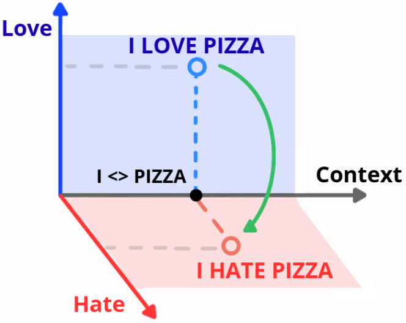
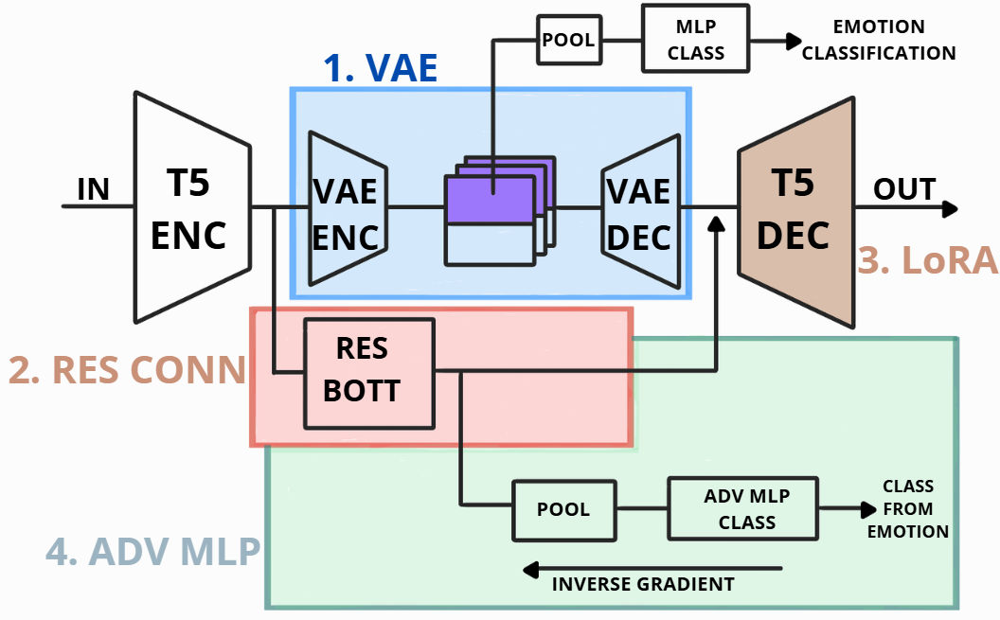
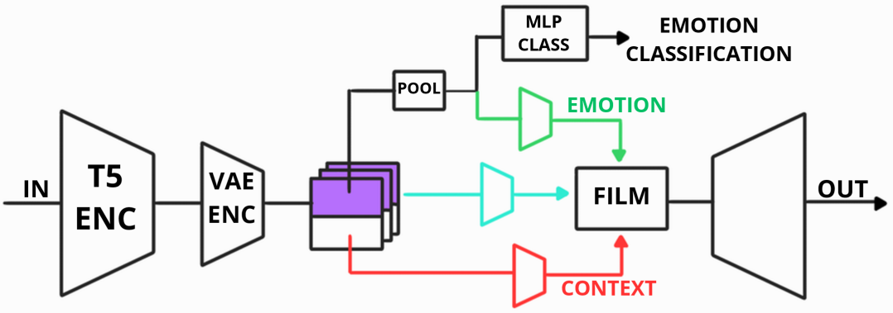

# Emotion Disentanglement via Variational Autoencoders

## Abstract

Encoder-decoder transformer models do not have interpretable hidden representations. Addressing this limitation can help with model alignment: disentangling the inner representations of different information can make it easier to access, edit and use. Current approaches use Variational Autoencoders (VAEs) to produce latents with interpretable components, with limited success. We experiment with a T5 + FactorVAE architecture, progressively expanding it to separate emotion from context. We test the model on classification and translation of emotion. Classification performs better than the BERT baseline, while translation fails despite our additions. The results suggest that we achieve partial disentanglement of emotion, but architecture and dataset are jointly insufficient to implement translation.


The intended latent edit keeps context fixed while moving the representation toward a target emotion:

<p align="center">
  
</p>

## Project at a glance

```text
text → FLAN-T5 encoder → FactorVAE emotion/context latents
     → conditioned FLAN-T5 decoder → reconstruction or emotion edit
```

The project evaluates four capabilities:

- multi-label emotion classification on GoEmotions;
- separation of emotion from contextual information;
- reconstruction of the input sentence;
- emotion translation while preserving meaning.

| Architectures 1–4                                                                            | Architecture 5                                             |
| -------------------------------------------------------------------------------------------- | ---------------------------------------------------------- |
|  |  |

## Experimented models

All variants use **FLAN-T5-base** and are evaluated primarily on the 28-label simplified **GoEmotions** task. The major ablations vary latent dimensions, pooling, classifier heads, residual connections, decoder LoRA, adversarial losses, and KL/total-correlation warmup schedules.

| Model                             | Main change                                                                         | Outcome                                                                               |
| --------------------------------- | ----------------------------------------------------------------------------------- | ------------------------------------------------------------------------------------- |
| **1. Base T5 + FactorVAE**        | Splits encoder states into emotion and context latents.                             | Useful classification and early disentanglement; poor reconstruction and translation. |
| **2. Residual bottleneck**        | Adds a compact skip path around the VAE.                                            | Stabilizes information flow, but reconstruction remains weak.                         |
| **3. Decoder LoRA + copy loss**   | Adapts the T5 decoder and directly rewards token reconstruction.                    | Near-perfect reconstruction; strong copying prevents dependable edits.                |
| **4. Adversarial regularization** | Pushes emotion out of context and residual branches with gradient reversal.         | Better separation metrics; translation still behaves like reconstruction.             |
| **5. Split-FiLM decoder**         | Removes the residual shortcut and injects pooled emotion through FiLM conditioning. | Best classification/disentanglement trade-off; translation remains unreliable.        |

## Repository map

```text
src/emotion_latent_learning/   Python package: data, models, training, evaluation
reproducible_scripts/          Slurm training, ablation, and evaluation jobs
ablations_results/             Curated result summaries
eda/                           GoEmotions exploration notebook and plots
img/                           Figures used in the final report
docs/                          Detailed experiment reproduction guide
```

Generated datasets, checkpoints, caches, logs, and full run artifacts are intentionally excluded from version control.

## Conclusion

We investigated whether the latent space of an encoder-decoder model can be disentangled into emotion and semantic context. To this end, we inserted a FactorVAE between the encoder and decoder of a T5 model and refined the architecture toward a FiLM-style design. The final models achieved competitive performance on emotion classification and sentence reconstruction, but failed to perform reliable emotion translation. These results suggest that the proposed research direction may be limited by dataset size, model choice, and an unavoidable emotional entanglement in the latent representation. Future work could explore alternative encoder-decoder models, such as BART, which is pretrained as a denoising autoencoder. Moreover, weakening copy loss through a stochastic mask may help reduce overfitting. Finally, applying dimensionality reduction and latent-space visualization techniques can help clarify why disentanglement and emotion-controlled generation remain challenging.

## Reports

- [Final report](<NLP Emo-Diva Report.pdf>)
- [Project proposal](Project_Proposal.pdf)
- Typst sources: [`main.typ`](main.typ) and [`Project_Proposal.typ`](Project_Proposal.typ)

---

## Quickstart

### 1. Clone and enter the project

```bash
git clone https://github.com/tebe-nigrelli/NLP-Latent-Learning.git
cd NLP-Latent-Learning
```

### 2. Install the environment

Install [`uv`](https://docs.astral.sh/uv/), then sync the locked Python 3.14 environment:

```bash
curl -LsSf https://astral.sh/uv/install.sh | sh
uv python install 3.14.2
uv sync
```

### 3. Verify the setup

```bash
uv run python -c "import torch, transformers; print(torch.__version__)"
```

GoEmotions is downloaded automatically through Hugging Face when a training or evaluation workflow first needs it. To inspect the dataset and report plots:

```bash
uv run jupyter lab eda/EDA.ipynb
```

Training was designed for a Slurm GPU cluster. Cluster preparation, smoke runs, every experiment command, evaluation workflows, and expected output files are documented in **[Reproducing the experiments](docs/REPRODUCING_EXPERIMENTS.md)**.
